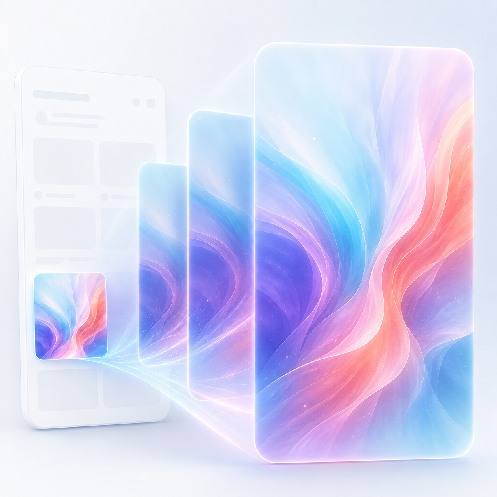

# TiZoomTransition

<p align="center">
  
</p>

`ti.zoomtransition` exposes Apple's native fluid zoom transition to Titanium on iOS 18 and later. It supports both modal presentation and `Ti.UI.NavigationWindow` pushes.

The transition is owned by UIKit, so opening, direct manipulation, cancellation, completion, and the return animation use the same system behavior as Apple apps. No private API or custom transition animator is used.

## Requirements

- iOS 18 or later
- Titanium SDK 13.3.0 or later
- An iOS 18-or-later SDK when building the app

## Installation

Add the module to `tiapp.xml`:

```xml
<ios>
  <min-ios-ver>18.0</min-ios-ver>
</ios>

<modules>
  <module platform="iphone" version="1.0.0">ti.zoomtransition</module>
</modules>
```

## Examples

- [Classic Titanium](example/app.js)
- [Alloy](example/alloy/)

The Alloy example keeps the modal `NavigationWindow`, its root `Window`, and its destination `TableView` in a separate controller. The selected source view is passed into that controller before the navigation window is prepared and opened.

## Full-screen modal with scroll handoff

```js
const Zoom = require('ti.zoomtransition');

const sourceView = Ti.UI.createView({
  width: 160,
  height: 160,
  borderRadius: 18,
  backgroundColor: '#6857f5'
});

sourceView.addEventListener('click', () => {
  const detailWindow = Ti.UI.createWindow({
    backgroundColor: '#11131a',
    modal: true,
    modalStyle: Ti.UI.iOS.MODAL_PRESENTATION_FULLSCREEN
  });

  const tableView = Ti.UI.createTableView({
    data: [
      Ti.UI.createTableViewRow({ title: 'Track 1' }),
      Ti.UI.createTableViewRow({ title: 'Track 2' })
    ]
  });

  detailWindow.add(tableView);

  Zoom.prepareWindow(detailWindow, {
    sourceView,
    scrollView: tableView,
    fullScreen: true
  });

  detailWindow.open({ animated: true });
});
```

When `scrollView` is supplied, a downward vertical interaction that begins inside that view can start the zoom dismissal only when:

```text
contentOffset.y <= -adjustedContentInset.top + scrollTopTolerance
```

UIKit still owns the gesture and transition physics. Horizontal/direct manipulation continues to use the system zoom-transition rules.

`scrollView` may be a `Ti.UI.ScrollView`, `Ti.UI.TableView`, or `Ti.UI.ListView`. The module resolves the native `UIScrollView` contained by the Titanium view.

## NavigationWindow push

The same prepared destination can be pushed:

```js
Zoom.prepareWindow(detailWindow, {
  sourceView,
  scrollView: tableView
});

navigationWindow.openWindow(detailWindow, { animated: true });
```

The navigation controller performs the interactive pop and the reverse zoom.

## API

### `isSupported()`

Returns `true` on iOS 18 and later.

### `prepareWindow(window, options)`

Prepares a destination `Ti.UI.Window` before it is opened or pushed.

Options:

- `sourceView` (required): The visible Titanium view from which the destination zooms and to which it returns.
- `scrollView` (optional): A Titanium scroll, table, or list view inside the destination.
- `interactiveDismiss` (optional, default `true`): Set to `false` to disable interactive zoom dismissal while retaining animated programmatic close/pop.
- `onlyWhenScrollAtTop` (optional, default `true`): When a `scrollView` is supplied, gate downward dismissal at its adjusted top edge.
- `scrollTopTolerance` (optional, default `1`): Nonnegative point tolerance for the top-edge test.
- `fullScreen` (optional, default `false`): Set the destination controller's modal presentation style to full screen.

Call this method after creating and populating the destination views, but before opening the window.

### `setSourceView(window, sourceView)`

Changes the return target for a prepared window. Use this before dismissal when the detail screen can move between items and needs to zoom back to a different visible source.

### `clearWindow(window)`

Removes the prepared transition. This is optional when the destination window is permanently released, and useful when reusing a window without zoom.

## Important behavior

- A real source view is required for a genuine zoom transition. It needs to remain alive and attached to the presenting interface when UIKit asks for it during dismissal.
- UIKit may call the source provider more than once and transitions may be interrupted at any time. Keep `open`, `focus`, `blur`, and `close` handling idempotent.
- A pull that begins while the supplied scroll view is away from its top remains a scroll. Once it is at the top, a new downward drag can begin dismissal.
- If the same top-edge pull is reserved for refresh, omit `scrollView` or set `onlyWhenScrollAtTop: false` and let UIKit use its default interaction policy.
- The module does not expose transition progress because Apple's public zoom API owns the interaction internally.

## License

MIT
